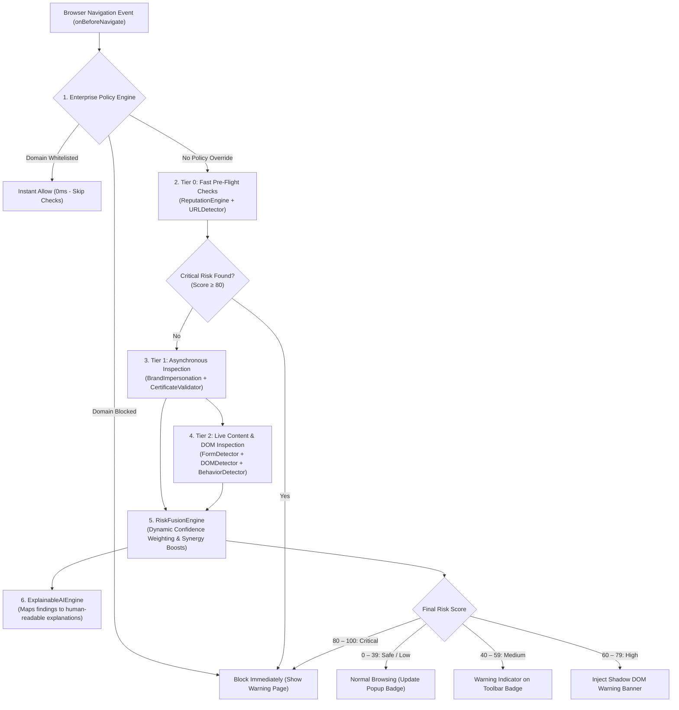

# IIPX — Intelligent Internet Phishing Extension

> **Privacy-first, real-time phishing and malicious website detection for modern web browsers.**

[](https://developer.chrome.com/docs/extensions/mv3/intro/)
[](#privacy--security-guarantees)
[](#the-engines-breakdown)
[](#design-philosophy)

**IIPX** is an offline-first browser security extension engineered to detect phishing, credential harvesting, brand spoofing, and malicious websites in real time. Running exclusively inside client-side browser runtimes, IIPX inspects web traffic, domain structures, and live DOM behaviors locally—protecting users before harm occurs **without ever sending browsing history, passwords, or URLs to third-party servers**.

---

## What Makes IIPX Different?

| Feature | Traditional Security Extensions | IIPX (Intelligent Internet Phishing Extension) |
| :--- | :--- | :--- |
| **Privacy** | Sends your URLs to cloud servers for checking | **100% Local & Offline.** Zero network telemetry. |
| **Latency** | 200ms – 1,000ms cloud roundtrip delays | **< 2ms local execution.** No page freeze or lag. |
| **Zero-Day Attacks** | Relies solely on static, outdated domain lists | **Heuristic & behavioral analysis** detects brand-new phishing kits. |
| **Explainability** | Shows a generic "Suspicious Website" warning | **Transparent evidence:** Explains the exact triggers found. |
| **Hallucination Risk** | High if using opaque cloud LLMs | **0% Hallucination.** Uses deterministic, verifiable algorithms. |

---

## Design Philosophy

IIPX adheres to strict architectural and operational principles:

* **Privacy-First Protection:** Analyze locally. Warn intelligently. Protect before harm occurs.
* **Low Latency & High Performance:** Tiered execution, debounced DOM mutation observers, and multi-layer LRU caching ensure zero perceptible impact on browsing speed.
* **Explainable AI & Heuristics:** Risk scores and threat classifications are grounded in verifiable findings with natural-language evidence.
* **Manifest V3 Native:** Built from the ground up for modern browser security standards using event-driven Service Workers and strict Content Security Policies (CSP).
* **Modular Plugin Architecture:** 9 independent security detector plugins coordinated through a prioritized scheduler and dynamic fusion engine.

---

## Architecture & Detection Flow

IIPX processes web traffic through a prioritized, three-tier detection pipeline designed with **early-exit capabilities** to maximize protection while minimizing CPU and battery usage:



---

## The Engines Breakdown

The core logic of IIPX is divided into **Core Pipeline Engines** (orchestration, risk scoring, explainability) and **Specialized Detection Engines** (the modular security plugins).

### 1. Core Pipeline Engines

* **EnterprisePolicyEngine (`src/core/policy/`):**  
  The first gatekeeper. Evaluates corporate allowlists, custom domain rules, and user overrides stored in `chrome.storage.local`. If a trusted domain is accessed, all heuristics are skipped instantly.
* **DetectionScheduler & DetectionEngine (`src/core/engine/`):**  
  Orchestrates all detector modules across prioritized execution tiers. Wraps every detector in strict timeouts (`Promise.race`) so a slow or hanging detector can never freeze the browser.
* **RiskFusionEngine (`src/core/fusion/`):**  
  Aggregates multiple detector findings into a normalized `0–100` risk score. Uses **dynamic confidence weighting**, prevents score dilution from safe detectors when severe threats exist, and applies **synergy boosts** when correlated attacks fire together (e.g., typosquatted domain + unencrypted password field).
* **ExplainableAIEngine (`src/core/xai/`):**  
  Translates raw threat signals into transparent, plain-English reasons (e.g., *"Form posts passwords to an insecure HTTP endpoint"*, *"Domain uses Cyrillic homograph spoofing"*). Eliminates AI hallucination by binding explanations directly to verified finding IDs.

---

### 2. The 9 Modular Detection Engines

Each detector implements the standardized `DetectorInterface` and can be enabled, disabled, or configured independently:

| Engine | Priority | Focus Area | Real-World Phishing Pattern Detected |
| :--- | :---: | :--- | :--- |
| **`ReputationEngine`** | 950 | Known Threat Intelligence | Pre-navigation lookup against an offline Bloom filter/Trie of verified malicious hosts and subdomains. |
| **`URLDetector`** | 900 | Domain & Lexical URL Math | Shannon entropy anomalies, Cyrillic/Greek Punycode homographs (e.g. `рaypal.com`), and typosquatting (e.g. `paypa1.com`). |
| **`BrandImpersonationDetector`** | 850 | Brand Spoofing & Phishing Kits | Delimited token matching, page title analysis, and favicon comparison against global brand registries. |
| **`FormDetector`** | 800 | Credential & Secret Harvesting | Password forms posting to `http://`, cross-domain credential actions, off-screen hidden inputs, and 12/24-word crypto seed phrase prompts. |
| **`DOMDetector`** | 700 | Structural Page Tampering | Invisible clickjacking overlays (`opacity: 0` stacked on buttons), zero-pixel iframes, and hidden deceptive containers. |
| **`BehaviorDetector`** | 600 | Anti-Analysis & UI Tricks | Disabled right-click (`contextmenu`), disabled text selection, fake browser update alerts, and automated form auto-submits. |
| **`CertificateValidator`** | 500 | Transport Security | Insecure plain HTTP schemes, invalid SSL/TLS certificates, and protocol downgrade attacks. |
| **`DomainIntelligence`** | 400 | Domain Metadata & Infrastructure | High-risk free TLD abuse (`.tk`, `.xyz`, etc.), unusual subdomain nesting, and suspicious port allocations. |
| **`NetworkAnomalyDetector`** | 300 | Data Exfiltration | Mixed active content, abnormal WebSocket endpoints, and suspicious third-party asset loads. |

---

## Risk Scoring Scale

| Score | Classification | Action Taken | UI Presentation |
| :---: | :---: | :--- | :--- |
| **0 – 19** | `SAFE` | No action required. | Green shield in popup. |
| **20 – 39** | `LOW` | Silent telemetry and state tracking. | Blue indicator badge. |
| **40 – 59** | `MEDIUM` | Advisory badge update. | Yellow warning badge. |
| **60 – 79** | `HIGH` | Injects interactive warning overlay into closed Shadow DOM. | Orange badge + in-page expandable banner. |
| **80 – 100**| `CRITICAL` | Blocks navigation before page load or redirects to warning page. | Red badge + full-page security block screen. |

---

## Machine Learning: Do You Need an ML Model?

**No — IIPX works 100% out of the box using deterministic heuristics.**

However, the architecture includes an extensible **`MLAdapter`** interface (`src/adapters/ml/MLAdapter.js`) designed for plug-and-play local machine learning models:

* **Why Heuristics are Primary:** They run in `< 2ms`, use minimal memory, have **0% hallucination risk**, and provide 100% transparent explanations.
* **How ML Can Be Used:** You can attach a lightweight local **TensorFlow.js** or **ONNX Runtime Web** model (`src/ml/models/`) to classify URL character n-grams or evaluate page text.
* **Hybrid Fusion:** In `RiskFusionEngine.js`, ML model predictions act as an auxiliary corroborating signal (`1.5 * confidence * score`) alongside deterministic findings, ensuring an ML false positive never accidentally blocks legitimate websites.

*For complete instructions on adding custom models, see [`src/ml/models/README.md`](src/ml/models/README.md).*

---

## Project Directory Structure

```text
├── manifest.json              # Chrome Manifest V3 configuration
├── package.json               # Test script and ES module definition
├── styles.css                 # Global styling tokens and variables
│
├── src/
│   ├── background/            # Background Service Worker (lifecycle, badge, navigation)
│   │   └── service-worker.js
│   ├── content/               # Content scripts, DOM observers, Shadow DOM overlay
│   │   └── content-script.js
│   ├── core/                  # Core architectural engines
│   │   ├── engine/            # DetectionEngine & DetectionScheduler
│   │   ├── fusion/            # RiskFusionEngine (score aggregation & synergy)
│   │   ├── xai/               # ExplainableAIEngine (evidence-backed explanations)
│   │   └── policy/            # EnterprisePolicyEngine (allowlists/blocklists)
│   ├── detectors/             # 9 independent modular security detectors
│   │   ├── url/               # URLDetector (entropy, typosquatting, homographs)
│   │   ├── brand/             # BrandImpersonationDetector
│   │   ├── form/              # FormDetector (credentials, seed phrases)
│   │   ├── dom/               # DOMDetector (clickjacking, hidden iframes)
│   │   ├── behavior/          # BehaviorDetector (anti-analysis, fake popups)
│   │   ├── certificate/       # CertificateValidator
│   │   ├── dns/               # DomainIntelligence
│   │   ├── network/           # NetworkAnomalyDetector
│   │   └── reputation/        # ReputationEngine (offline bloom filter/lists)
│   ├── plugins/               # PluginRegistry & DetectorInterface contract
│   ├── cache/                 # Multi-layer LRU cache silos (URL, domain, results)
│   ├── adapters/              # Pluggable adapters (Storage, ML, OCR, Visual)
│   ├── ui/                    # User interface files
│   │   ├── popup/             # Extension toolbar popup (popup.html, popup.js)
│   │   ├── warning/           # Standalone full-page warning (warning.html, warning.js)
│   │   └── dashboard/         # Policy & analytics dashboard (dashboard.html, dashboard.js)
│   ├── utils/                 # Math (Entropy, Levenshtein), Punycode, and crypto utils
│   └── tests/                 # Unit and integration test suites
│       ├── unit/              # URL detector and fusion engine unit tests
│       ├── integration/       # End-to-end detection pipeline integration tests
│       └── run-all-tests.js   # Automated test runner
```

---

## Running the Test Suite

IIPX includes an automated test suite verifying URL parsing, homograph decoding, typosquatting logic, synergy boosts, and score fusion:

```bash
# Run all unit and integration tests
npm test

# Or run directly with Node.js
node src/tests/run-all-tests.js
```

---

## Installation & Setup

### Google Chrome / Microsoft Edge / Brave / Opera

1. **Clone the repository:**
   ```bash
   git clone https://github.com/JEFFERSON-007/IIPX-Intelligent-Internet-Phishing-Extension.git
   ```
2. Open your browser and navigate to the extensions management page:
   * **Chrome / Brave:** `chrome://extensions/`
   * **Edge:** `edge://extensions/`
3. Toggle on **Developer mode** (usually located in the top-right corner).
4. Click the **Load unpacked** button.
5. Select the `IIPX-Intelligent-Internet-Phishing-Extension` project root folder.
6. The **IIPX** shield icon will appear in your browser toolbar!

---

## Privacy & Security Guarantees

* **Zero Remote Telemetry:** No user analytics, no tracking pixels, and no browsing logs are transmitted.
* **Strict CSP:** The extension does not load remote scripts, executable blobs, or external stylesheets.
* **Isolated Shadow DOM:** Warning banners are injected into a closed Shadow DOM root, preventing malicious host page scripts from reading, hijacking, or hiding the security warning.

---

## Contributors

Contributions, issues, and feature requests are welcome. Feel free to check the [Issues](https://github.com/JEFFERSON-007/IIPX-Intelligent-Internet-Phishing-Extension/issues) page.

### Author & Maintainer
* **Jefferson Raja** ([@JEFFERSON-007](https://github.com/JEFFERSON-007)) — Project Creator & Lead Architect

### All Contributors
* See the full list on [GitHub Contributors](https://github.com/JEFFERSON-007/IIPX-Intelligent-Internet-Phishing-Extension/graphs/contributors).

---

## Recent Activity

<!--START_SECTION:activity-->
1. Commented on [#3121](https://github.com/sherlock-project/sherlock/issues/3121#issuecomment-5868705024) in [sherlock-project/sherlock](https://github.com/sherlock-project/sherlock)
<!--END_SECTION:activity-->

